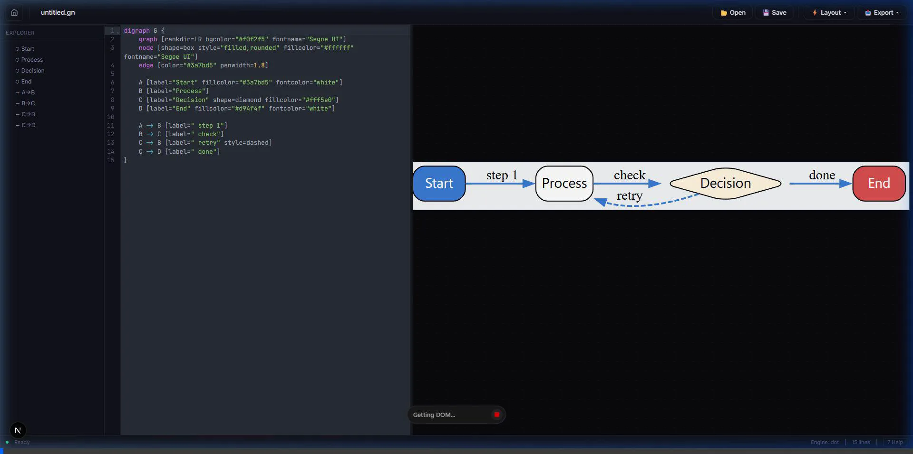
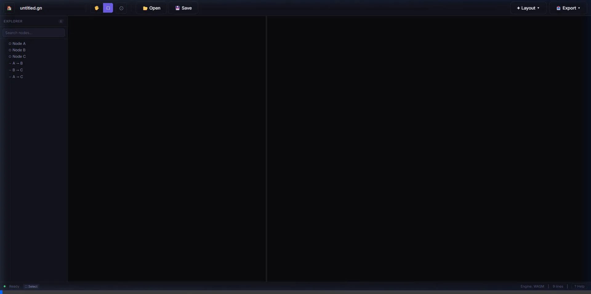

# Grafnuts ✦  
https://graphnuts.vercel.app/  

Grafnuts is an ultra-fast, WASM-powered Graphviz diagram editor built with Next.js and Convex. It supports **true real-time drag & drop logic** where edge connections visually adapt instantly to node movements via DOM transformation, with Graphviz providing the backbone layout logic on demand.

<p align="center">
  
</p>

## Real-time Code & UI Sync
Grafnuts relies on a bespoke WebAssembly Engine combined with D3 SVG math tracking to give Graphviz shapes native drag-and-drop mechanics.  

<p align="center">
  
  
</p>

## Features

- **Blazing Fast Custom WASM Engine:** A custom-compiled C++ Graphviz engine ensures near-instant compilation times, running completely client-side.
- **Real-Time Client-Side Dragging:** Experience completely lag-free dragging. Node dragging surgically manipulates SVG `<path>` vectors without awaiting costly layout re-evaluations.
- **Collaborative Real-Time Editing:** Synchronized with Convex backend for live diagram sharing and changes syncing between users.
- **Hybrid Code-and-Canvas Experience:** Integrated Ace/CodeMirror editor working alongside the D3-zoomable viewing UI.
- **Robust Import/Export Tools:** Export diagrams flawlessly as PNG, JPG, PDF, or SVG. Load existing `.gv` or `.dot` files directly into the editor.
- **Full Customizability:** Right-click context menus built directly on the canvas space allow for changing node shapes (Rect, Circle, Cylinder, Diamond) or edge styles (Bold, Dotted, Dashed) instantly.

## Getting Started

1. Set up your `.env` variables ensuring `NEXT_PUBLIC_CONVEX_URL` or `CONVEX_DEPLOY_KEY` are configured.
2. If using GitHub authentication, also configure `GIT_CLIENT_ID` and `GIT_CLIENT_SECRET`.

Ensure you have **bun** or **node** installed:

```bash
bun install
bun run dev
```

Open [http://localhost:3000](http://localhost:3000) with your browser to try it locally.

## License

MIT
